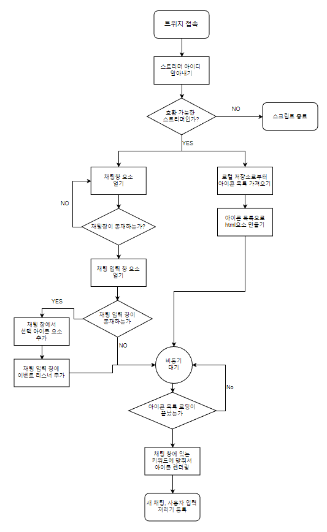

위 순서도는 구현 코드와 맞지 않는 부분이 있지만 대략적인 개요로는 크게 다르지 않다고 생각함.

`manifest.json`파일에서 `content_scripts.js`항목의 파일들은 순서대로 실행이 된다. 따라서 의존성 관리는 파일 목록 순서로 하면 될 것이다.

여기서 중요한 점은 각 `.js`파일들은 순서대로 선언이 되지만 원하는 대로 하려면 `Promise`써야한다.

## 개발노트

- 사용자 입력 감시하는데 `MutationObserver` 안쓰는 이유?

감시 대상을 `contenteditable="true"`인 `div`로 했었는데 붙여넣기와 한글자 입력 시에 작동이 되지 않았음. 대신에 html 요소에  `onkeyup`, `onkeydown`, `onpaste` 리스너 등록해서 사용함.