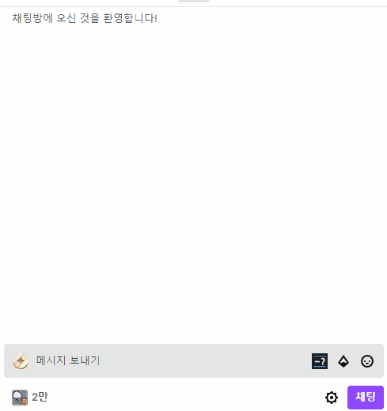

# Features

- 트위치 생방송, 트위치 다시보기, popout 채팅창, 클립 페이지에서 작동
- 페이지 이동 시에도 끊김 없이 동작
- 버튼 클릭 시 아이콘 목록 보기
- 채팅창에 `~` 입력 시 아이콘 목록 검색 가능
- 아이콘 목록에서 `←`, `→`으로 탐색, `↓`으로 입력. (커서가 입력의 끝이 아닐 때는 남은 문자열을 클립보드에 복사함) 
- 아이콘 목록에서 클릭시 입력창에 붙여넣기 또는 클립보드에 복사
- 채팅창에서 아이콘 클릭 시 입력창에 붙여넣기 또는 클립보드에 복사
- 아이콘 목록은 사용자가 입력한 아이콘 중에서 빈도가 높은 순으로 정렬해서 보여줌 (통계 부분은 로컬 스토리지에 저장되고 서버로 전송되거나 구글 계정에 연동되지 않음.)



- 전체 아이콘 목록과 개인 통계를 볼 수 있음. [소스코드 - chrome branch](https://github.com/k123s456h/twitch-icon-frontend) 


# special thanks to...

Funzinnu

Icons by svgrepo.com

# FAQs

- 이미지 서버는 어떤 것으로 사용하는가?

개인 서버에서 업데이트가 필요할 때마다 또는 2주마다 해당 스트리머가 제공하는 아이콘 목록을 불러온 후 파싱 및 서버에 캐시해놓음. 그것을 사용함.

# TODOs?

## BUGs
- [ ] 아래키 입력 이후에 채팅을 전부 지우고 다시 쓸 때 절반 정도의 경우로 선택기가 활성화 되지 않음 : `~팝콘` 입력 후 페페팝콘 선택한 다음에 ~까지 지우고 아무 글자나 친 뒤 다시 전부 지우고 ~입력해보기 // 재현되지 않음. 테스트 필요
- [ ] 렌더링 되지 않은 아이콘 항목도 통계에 반영되는 현상. 수정할 필요는 없다고 생각함.
- [x] ~~채팅창 숨기고 다시 보였을 때 선택기가 활성화 되지 않음 => .`stream-chat`에 observer 설치하기~~
- [x] ~~영문 대소문자 구분 안하도록 해야 함.~~
- [x] ~~`~피곤` 입력 시에 뭔가 의도하지 않은게 나옴 => name이 같아서 생기는 문제. nameHash로 사용해서 해결~~
- [x] ~~링크 또는 이모티콘이 포함된 채팅인 경우 순서가 이상하게 됨. => 현재 코드는 공백으로 나눠서 각 토큰을 `span.text-fragment` 으로 생성하는 식으로 만듬. `span.text-fragment`의 부모를 찾아서 자식을 찾고 `.text-fragment`이후에 아이콘 이미지 요소를 추가하는 방식으로 구현해야 할 듯.~~

## Features
- `[]` 명령어 구현하기 : 목록은 수동관리 해야할 듯
```
[b]굵은글씨
[i]기울어짐
[s]취소선
'''굵은글씨'''
''기울어짐''
~~취소선~~
--취소선--
__밑줄글씨__
[br]줄바꿈
[mq]흘러갈말[/mq]
```
- 봇 명령어 `!` 구현하기 : 목록은 수동 관리 해야할 듯